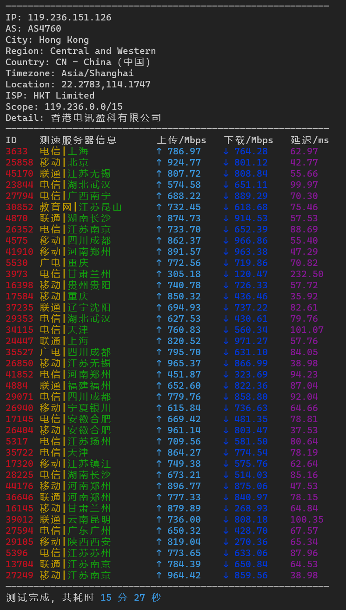

## ChinaBench

连接中国各地的节点进行全面测速，可单独选择移动、电信、联通节点。

+ 国内服务器：测试全国各地不同运营商的访问带宽

+ 国外服务器：测试搭建代理服务器直连速度，各运营商的线路质量（上行带宽与延迟大致反映代理质量）

### Quick Start

输入以下命令开启测速

```
bash <(curl -Lso- st.343.re/cn)
```



### About

Base on [Speedtest](https://www.speedtest.net/about) by Ookla, UI reference [superspeed](https://github.com/ernisn/superspeed.git) project.

MIT ©2022 [@dnomd343](https://github.com/dnomd343)
